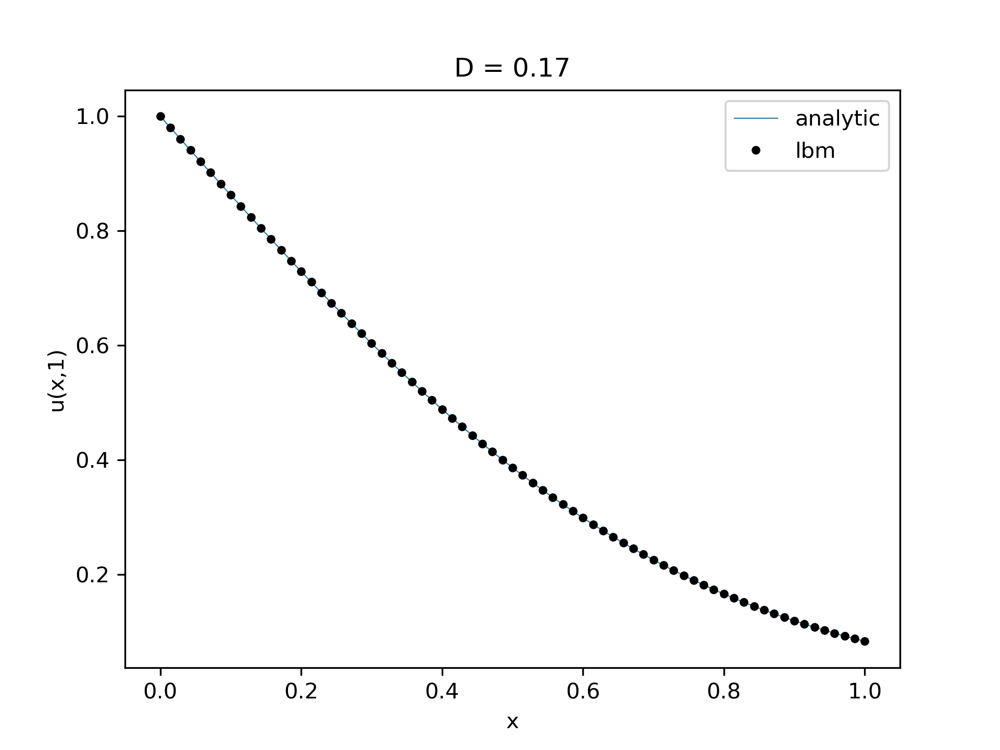

# 1D Diffusion (sort of)

1D semi-infinite diffusion (Lab 3 From Alexiades PDE course). Sort of a little
hack: its really a D2Q5 2d lattice (not a D1Q3), but both sides are periodic so
it only varies along one axis. This is just a little sanity check/tutorial for
using Palabos and getting used to the units.



| parameter         | description                     | expression [unit]     |
| ---               | ---                             | ---                   |
| $\tau$            | Relaxation time                 | variable $\rightarrow$ controls D [-]|
| $D$ (or $\kappa$) | Diffusivity (or Conductivity)  | $\frac{1}{3} (\tau - \frac{1}{2})$ [-] |
| $resolution$      | mesh resolution (lattice units per physical unit) | [-] |
| $\Delta t$        | time step (seconds per iteration) | $(\frac{1}{resolution})^2$|
| $max_{iter}$      | iterations to yield 1 second simulation | $\frac{1}{\Delta t}$ (integer) |

----

## Example Calculations

For the base case we will use the regular D2Q5 BGK lattice to fix tau, ch and
ct, then we will modify the diffusion coefficient without having to change tau.
We want to make Diffusivity / Conductivity = 0.1 $\frac{cm^2}{s}$ and have a
lattice spacing of 64 lattice units per cm.

For this case $\tau$ is dependent on D: $tau$

| parameter     |  expression [unit]  |
| ---           |  ---                |
| $\tau$        | $1.0$               |
| $D$           | $\frac{1}{3} (\tau-\frac{1}{2}) = \frac{1}{6}$
| $Resolution$  | 64  |
| $\Delta x$    | $\frac{1}{64}$ |
| $\Delta t$    | $\frac{1}{64^2} = \frac{1}{4096}$ |
| $max_{iter}$  | 4096 |

Testing out the program: this means that the LBM program must undergo 4096
iterations to equal 1 second of physical time.

----

## Initial Condition and Boundary Conditions

To be honest I am not exactly sure why you use the pointer syntax to make the
boundary condition, but this is how they do it in Palabos. You can look at the
documentation for the OnLatticeAdvectionDiffusionBoundaryCondition to see more.

```c++
void domain_setup( MultiBlockLattice2D<T,ADESCRIPTOR>& adLattice, IncomprFlowParam<T>& parameters )
{
  ...
  ...
  ...
  // INITIAL CONDITION
  initializeAtEquilibrium(  adLattice,....)

  // BOUNDARY CONDITION 
  //  bc is a pointer to the boundary condition
  OnLatticeAdvectionDiffusionBoundaryCondition2D<T, ADESCRIPTOR>*
    bc = createLocalAdvectionDiffusionBoundaryCondition2D<T,ADESCRIPTOR>();

  // the '->' syntax in c++ references the virtual method of a pointed to object
  bc->addTemperatureBoundary1N(south_boundary,adLattice);

  setBoundaryDensity(adLattice,south_boundary,(T)1.0);

  ...

}
```
